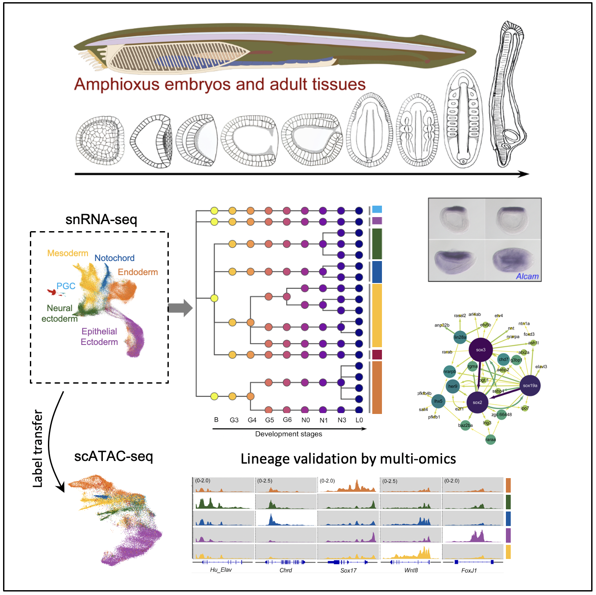

# AmphioxusAnalysis

The source code for the analysis of snRNA-seq and scATAC-seq of amphioxus.

The package for building the developmental tree can be found at: https://github.com/XingyanLiu/stagewiseNN

Citation:
> Pengcheng Ma, Xingyan Liu, Zaoxu Xu et al., 
> **Joint profiling of gene expression and chromatin accessibility of amphioxus 
> development at single-cell resolution**,
> _Cell Reports_ (2022), https://doi.org/10.1016/j.celrep.2022.110979

| File                           | Description                                                                                    |
|--------------------------------|------------------------------------------------------------------------------------------------|
| rna_proc_stagewise.py          | preprocessing, clustering, and visualization of the snRNA-seq data                             |
| de-nearstage.R                 | differential expression analysis - current vs the previous stage                               |
| atac_preproc.R                 | preprocessing and visualization of the scATAC-seq data                                         |
| atac2ga_cicero.R               | compute the gene activities (GA) from the scATAC-seq data                                      |
| omics_integration-Harmony.R    | integration of snRNA_seq and scATAC-seq data using Harmony, and KNN-based label transfer       |
| omics_integration-Seurat.R     | integration of snRNA_seq and scATAC-seq data using Seurat                                      |
| lineage_dynamics-swnn-GA.ipynb | using StagewiseNN to integrately visualize the scATAC-seq data across six stages (based on GA) |
| GRN-scenic.py                  | compute the TF-target pairs using pySCENIC                                                     |
| GRN-intersection.py            | compute the species-conserved TF-target pairs                                                  |
| GRN-filter.py                  | filter TF-target pairs based on their DE lineages                                              |
| src/*                          | general utils functions (Python)                                                               |
| RFunx.R                        | general utils functions (R)                                                                    |
| RFunxATAC.R                    | utils functions for analysis related to scATAC-seq data                                        |
| RFunxTreePlot.R                | utils functions for plotting the tree                                                          |
| COLOR_SETS.R                   | the color set                                                                                  |

